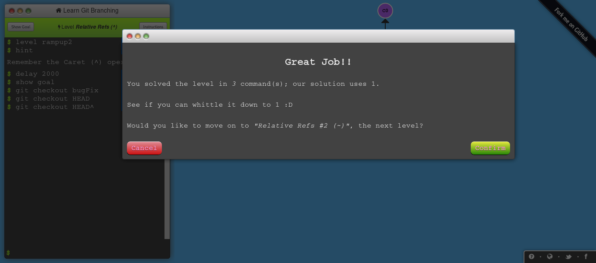
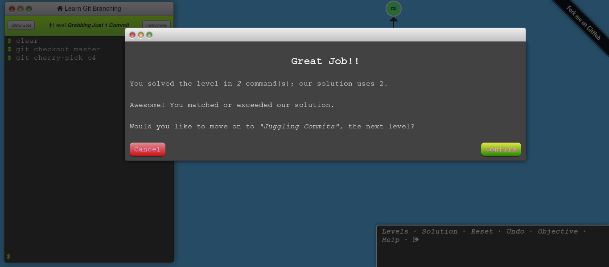
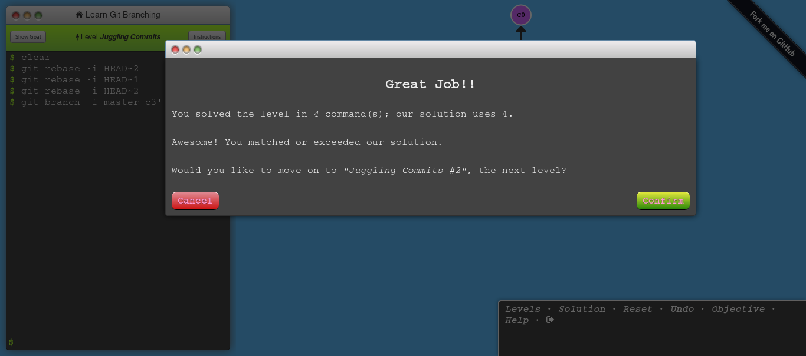

# Laboratorio 1 - Git

* **Nombre del profesor:** Sebastian David Moreno Bernal
* **Fecha límite:** Viernes 27 de Marzo de 2020.
* **Nombre del estudiante:** Guiselle Tatiana Zambrano Penagos

## Introduction Sequence

### Git Commits

* **Comandos utilizados:**

	```
	git commit
	git commit
	```
* **Screenshot:**
	
	\

### Git Branches

* **Comandos utilizados:**

	```
	git checkout -b bugFix
	```
* **Screenshot:**
	
	\

### Branches and Merging

* **Comandos utilizados:**

	```
	git checkout -b bugFix
	git commit
	git checkout master
	git commit
	git merge bugFix
	```
* **Screenshot:**
	
	\

### Git Rebase

* **Comandos utilizados:**

	```
	git checkout -b bugFix
	git commit
	git checkout master
	git commit
	git checkout bugFix
	git rebase master	
	```
* **Screenshot:**
	
	\

## Ramping Up
### Moving around in Git

* **Comandos utilizados:**

	```
	git checkout C4
	```
* **Screenshot:**
	
	\

### Relative Refs

* **Comandos utilizados:**

	```
	git checkout bugFix
	git checkout HEAD^
	```
* **Screenshot:**
	
	\

### The "~" operator

* **Comandos utilizados:**

	```
	git checkout master
	git checkout HEAD~2
	git branch -f master c6
	git branch -f bugFix HEAD^
	```
* **Screenshot:**
	
	\

### Reversing Changes in Git

* **Comandos utilizados:**

	```
	git reset HEAD^
	git checkout pushed
	git revert HEAD
	```
* **Screenshot:**
	
	\

## Moving Work Around

### Git Cherry-pick 

* **Comandos utilizados:**

	```
	git cherry-pick c3 c4 c7
	```
* **Screenshot:**
	
	\

### Git Interactive Rebase

* **Comandos utilizados:**

	```
	git rebase -i HEAD~4
	# c3, c5, c4
	```
* **Screenshot:**
	
	\

## A Mixed Bag

### Locally stacked commits

* **Comandos utilizados:**

	```
	git checkout master
	git cherry-pick c4
	```
* **Screenshot:**
	
	\

### Juggling Commits

* **Comandos utilizados:**

	```
	git rebase -i HEAD~2
	git rebase -i HEAD~1
	git rebase -i HEAD~2
	git branch -f master c3'''
	```
* **Screenshot:**
	
	\

### 

* **Comandos utilizados:**

	```
	```
* **Screenshot:**
	
	\

### 

* **Comandos utilizados:**

	```
	```
* **Screenshot:**
	
	\

### 

* **Comandos utilizados:**

	```
	```
* **Screenshot:**
	
	\

### 

* **Comandos utilizados:**

	```
	```
* **Screenshot:**
	
	\


	```
	```
