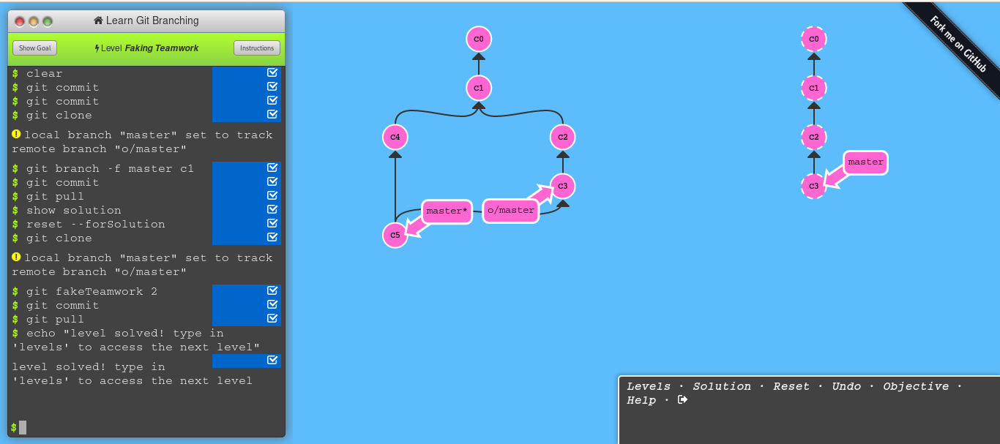

# Laboratorio 1 - Git

* **Nombre del profesor:** Sebastian David Moreno Bernal
* **Fecha límite:** Viernes 27 de Marzo de 2020.
* **Presentado por:** Guiselle Tatiana Zambrano Penagos

## Introduction Sequence

### Git Commits

* **Comandos utilizados:**

	```
	git commit
	git commit
	```
* **Screenshot:**
	
	\

### Git Branches

* **Comandos utilizados:**

	```
	git checkout -b bugFix
	```
* **Screenshot:**
	
	\

### Branches and Merging

* **Comandos utilizados:**

	```
	git checkout -b bugFix
	git commit
	git checkout master
	git commit
	git merge bugFix
	```
* **Screenshot:**
	
	\

### Git Rebase

* **Comandos utilizados:**

	```
	git checkout -b bugFix
	git commit
	git checkout master
	git commit
	git checkout bugFix
	git rebase master	
	```
* **Screenshot:**
	
	\

## Ramping Up
### Moving around in Git

* **Comandos utilizados:**

	```
	git checkout C4
	```
* **Screenshot:**
	
	\

### Relative Refs

* **Comandos utilizados:**

	```
	git checkout bugFix
	git checkout HEAD^
	```
* **Screenshot:**
	
	\

### The "~" operator

* **Comandos utilizados:**

	```
	git checkout master
	git checkout HEAD~2
	git branch -f master c6
	git branch -f bugFix HEAD^
	```
* **Screenshot:**
	
	\

### Reversing Changes in Git

* **Comandos utilizados:**

	```
	git reset HEAD^
	git checkout pushed
	git revert HEAD
	```
* **Screenshot:**
	
	\

## Moving Work Around

### Git Cherry-pick 

* **Comandos utilizados:**

	```
	git cherry-pick c3 c4 c7
	```
* **Screenshot:**
	
	\

### Git Interactive Rebase

* **Comandos utilizados:**

	```
	git rebase -i HEAD~4
	# c3, c5, c4
	```
* **Screenshot:**
	
	\

## A Mixed Bag

### Locally stacked commits

* **Comandos utilizados:**

	```
	git checkout master
	git cherry-pick c4
	```
* **Screenshot:**
	
	\

### Juggling Commits

* **Comandos utilizados:**

	```
	git rebase -i HEAD~2
	git rebase -i HEAD~1
	git rebase -i HEAD~2
	git branch -f master c3'''
	```
* **Screenshot:**
	
	\

### Juggling Commits 2

* **Comandos utilizados:**

	```
	git checkout HEAD~2
	git cherry-pick c2
	git checkout HEAD~1
	git cherry-pick c2'
	git cherry-pick c3
	git branch -f master c3'
	```
* **Screenshot:**
	
	\

### Git Tags 

* **Comandos utilizados:**

	```
	git tag v0 c1
	git tag v1 c2
	git checkout c2
	```
* **Screenshot:**
	
	\

### Git Describe 

* **Comandos utilizados:**

	```
	git describe c2
	git describe c4
	git describe c6
	git describe c1
	git describe c3
	```
* **Screenshot:**
	
	\

## Advanced Topics

### Rebasing Multiple Branches

* **Comandos utilizados:**

	```
	git rebase master bugFix
	git rebase bugFix side~2
	git rebase HEAD side~1
	git rebase HEAD side
	git rebase side another
	git branch -f master another
	```
* **Screenshot:**
	
	\


	```
	```
### Specifying Parents

* **Comandos utilizados:**

	```
	git branch -f bugWork HEAD~^2~
	```
* **Screenshot:**

	\

### Branch Spaghetti

* **Comandos utilizados:**

	```
	git checkout one
	git cherry-pick c4
	git cherry-pick c3
	git cherry-pick c2
	git checkout two
	git cherry-pick c5
	git cherry-pick c4'
	git cherry-pick c3'
	git cherry-pick c2'
	git branch -f three c2
	```
* **Screenshot:**

	\

## Push & Pull -- Git Remotes!

### Our Command to create remotes

* **Comandos utilizados:**

	```
	git clone
	```
* **Screenshot:**

	\

### Git Remote Branches 

* **Comandos utilizados:**

	```
	git commit
	git checkout o/master
	git commit
	```
* **Screenshot:**

	\

### Git Fetch

* **Comandos utilizados:**

	```
	git fetch
	```
* **Screenshot:**

	\

### Git Pull

* **Comandos utilizados:**

	```
	git pull
	```
* **Screenshot:**

	\

### Simulating Collaboration

* **Comandos utilizados:**

	```
	git commit
	git commit
	git clone
	git branch -f master c1
	git commit
	git pull
	```
* **Screenshot:**

	\

### git push

* **Comandos utilizados:**

	```
	git commit
	git commit
	git push
	```
* **Screenshot:**

	\

### Diverged Work

* **Comandos utilizados:**

	```
	git clone
	git fakeTeamwork
	git commit
	git pull --rebase
	git push
	git fakeTeamwork
	```
* **Screenshot:**

	\

### Remote Rejacted

* **Comandos utilizados:**

	```
	git reset --hard o/master
	git checkout -b feature c2
	git push origin feature
	```
* **Screenshot:**

	\

## To origin and Beyoun -- Advanced Git Remotes!

### Merging feature branches

* **Comandos utilizados:**

	```
	git fetch
	git rebase o/master side1
	git rebase side1 side2
	git rebase side2 side3
	git rebase side3 master
	git push
	```
* **Screenshot:**

	\

### Why no merge?

* **Comandos utilizados:**

	```
	git checkout master
	git pull
	git merge side1
	git merge side2
	git merge side3
	git push
	```
* **Screenshot:**

	\

### Remote-Tracking branches

* **Comandos utilizados:**

	```
	git checkout -b side o/master
	git commit
	git pull --rebase
	git push
	```
* **Screenshot:**

	\

### Push Arguments

* **Comandos utilizados:**

	```
	git push origin master
	git push origin foo
	```
* **Screenshot:**

	\

### <place> argument details

* **Comandos utilizados:**

	```
	git push origin master^:foo
	git push origin foo:master
	```
* **Screenshot:**

	\

### Git fetch arguments

* **Comandos utilizados:**

	```
	git fetch origin master~1:foo
	git fetch origin foo:master
	git checkout foo
	git merge master
	```
* **Screenshot:**

	\

### Oddites of <surce>

* **Comandos utilizados:**

	```
	git push origin :foo
	git fetch origin :bar
	```
* **Screenshot:**

	\

### Git pull arguments

* **Comandos utilizados:**

	```
	git pull origin bar:foo
	git pull origin master:side
	```
* **Screenshot:**

	\

